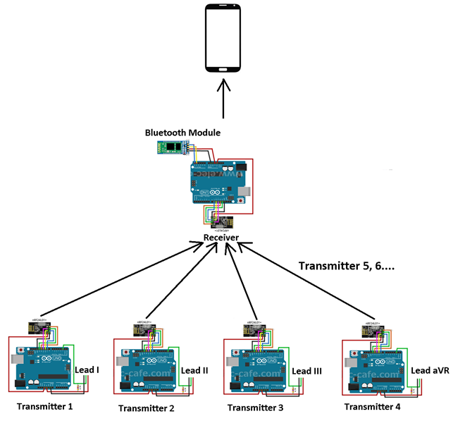
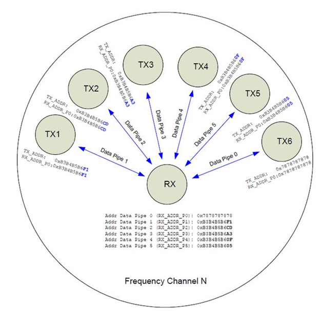
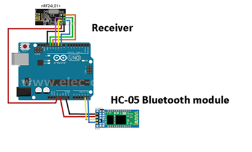
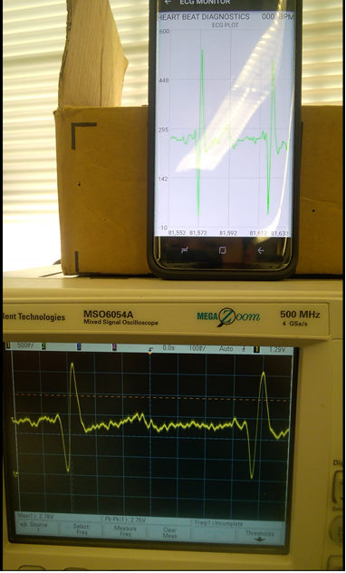

# WIRELESS ECG MONITOR USING MOBILE DEVICE

* The objective of this project is to design a simple wireless electrocardiogram (ECG) monitoring system right on the user’s mobile device for convenience and mobility. This wireless ECG monitor potentially improves the quality of life of the user in general or cardiac patients in particular. The project has been completed using Radio Frequency transmission and receiver, Bluetooth technology, an ECG circuit and a mobile device for the monitoring of the signals.
* Wireless communication and the transmitting/receiving of the signals is as follows:

* The ECG signals such as Lead I, Lead II, Lead aVR, etc. measured by the circuits are the inputs to each of the Arduino that is connected to a specific RF module, which will be used as transmitters. These transmitted ECG signals will be sent to a separate Arduino that is also connected to the same RF module; however, this one is used as a Receiver.
* This whole network is called multiple transmitters with one receiver. The receiver is picking up all these signals simultaneously, and this Receiver is also connected to a Bluetooth module that is used to transmit again the received signals to the Mobile device.

* HC-05 Bluetooth Module: used to transmit these signals to the Mobile Device using Bluetooth, and the Bluetooth module that was used is the HC-05 Bluetooth module. This module is directly connected to the Arduino that is used as the receiver as seen below:

* **Android_ECG_Monitor** is an android application written in Java that is paired with our HC-05 bluetooth modules to receive these ECG signals wirelessly and display them in real time.

